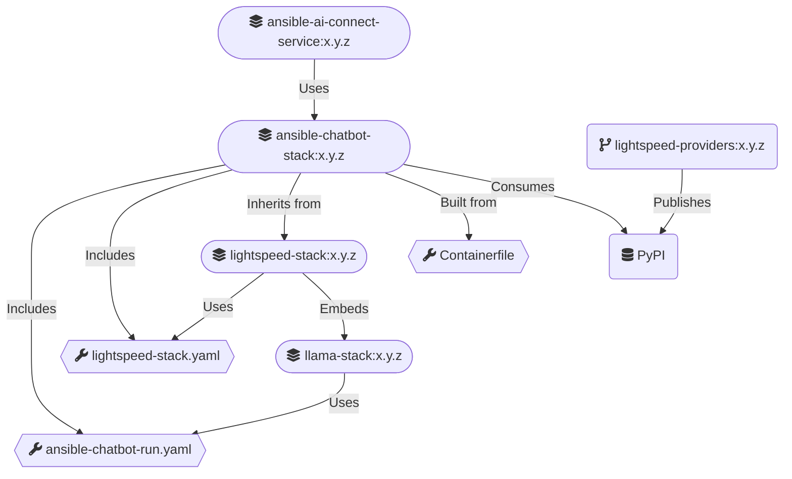

# Ansible Chatbot (llama) Stack

This repository contains the necessary configuration to build a Docker Container Image for `ansible-chatbot-stack`.

`ansible-chatbot-stack` builds on top of `lightspeed-stack` that wraps Meta's `llama-stack` AI framework.

`ansible-chatbot-stack` includes various customisations for:

- A remote vLLM inference provider (RHOSAI vLLM compatible)
- The inline sentence transformers (Meta)
- AAP RAG database files and configuration
- [Lightspeed external providers](https://github.com/lightspeed-core/lightspeed-providers)
- System Prompt injection

Build/Run overview:



## Build

### Setup for Ansible Chatbot Stack

- External Providers YAML manifests must be present in `providers.d/` of your host's `llama-stack` directory.
- Vector Database is copied from the latest `aap-rag-content` image to `./vector_db`.
- Embeddings image files are copied from the latest `aap-rag-content` image to `./embeddings_model`.

```shell
        make setup
```

### Building Ansible Chatbot Stack

Builds the image `ansible-chatbot-stack:$ANSIBLE_CHATBOT_VERSION`.

> Change the `ANSIBLE_CHATBOT_VERSION` version and inference parameters below accordingly.

```shell
    export ANSIBLE_CHATBOT_VERSION=0.0.1
    
    make build
```

### Container file structure

#### Files from `lightspeed-stack` base image
```commandline
└── app-root/
    ├── .venv/
    └── src/
        ├── <lightspeed-stack files>
        └── lightspeed_stack.py
````

#### Runtime files

> These are stored in a `PersistentVolumeClaim` for resilience
```commandline
└── .llama/
    └── data/
        └── distributions/
            └── ansible-chatbot/
                ├── aap_faiss_store.db
                ├── agents_store.db
                ├── responses_store.db
                ├── localfs_datasetio.db
                ├── trace_store.db
                └── embeddings_model/
```

#### Configuration files
```commandline
└── .llama/
    ├── distributions/
    │   └── ansible-chatbot/
    │       ├── lightspeed-stack.yaml
    │       ├── ansible-chatbot-run.yaml
    │       ├── ansible-chatbot-version-info.json
    │       └── system-prompts/
    │           └── default.txt
    └── providers.d
        └── <llama-stack external providers>
```

## Run

Runs the image `ansible-chatbot-stack:$ANSIBLE_CHATBOT_VERSION` as a local container.

> Change the `ANSIBLE_CHATBOT_VERSION` version and inference parameters below accordingly.

```shell
    export ANSIBLE_CHATBOT_VERSION=0.0.1
    export ANSIBLE_CHATBOT_VLLM_URL=<YOUR_MODEL_SERVING_URL>
    export ANSIBLE_CHATBOT_VLLM_API_TOKEN=<YOUR_MODEL_SERVING_API_TOKEN>
    export ANSIBLE_CHATBOT_INFERENCE_MODEL=<YOUR_INFERENCE_MODEL>
    export ANSIBLE_CHATBOT_INFERENCE_MODEL_FILTER=<YOUR_INFERENCE_MODEL_TOOLS_FILTERING>
    
    make run
```

## Basic tests

Runs basic tests against the local container.

> Change the `ANSIBLE_CHATBOT_VERSION` version and inference parameters below accordingly.

```shell
    export ANSIBLE_CHATBOT_VERSION=0.0.1
    export ANSIBLE_CHATBOT_VLLM_URL=<YOUR_MODEL_SERVING_URL>
    export ANSIBLE_CHATBOT_VLLM_API_TOKEN=<YOUR_MODEL_SERVING_API_TOKEN>
    export ANSIBLE_CHATBOT_INFERENCE_MODEL=<YOUR_INFERENCE_MODEL>
    export ANSIBLE_CHATBOT_INFERENCE_MODEL_FILTER=<YOUR_INFERENCE_MODEL_TOOLS_FILTERING>
    
    make run-test
```

## Deploy into a k8s cluster

### Change configuration in `kustomization.yaml` accordingly, then

```shell
    kubectl kustomize . > my-chatbot-stack-deploy.yaml
```

### Deploy the service

```shell
    kubectl apply -f my-chatbot-stack-deploy.yaml
```

## Appendix - Host clean-up

If you have the need for re-building images, apply the following clean-ups right before:

```shell
    make clean
```

## Appendix - Obtain a container shell

```shell
    # Obtain a container shell for the Ansible Chatbot Stack.
    make shell
```
