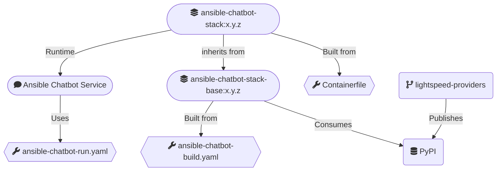

# Ansible Chatbot (llama) Stack

An Ansible Chatbot (llama) Stack [custom distribution](https://llama-stack.readthedocs.io/en/latest/distributions/building_distro.html) (`Container` type).

It includes:
- A remote vLLM inference provider (RHOSAI vLLM compatible)
- The inline sentence transformers (Meta)
- AAP RAG database files and configuration
- [Lightspeed external providers](https://github.com/lightspeed-core/lightspeed-providers)
- Other default providers from the [Remote vLLM distribution](https://llama-stack.readthedocs.io/en/latest/distributions/self_hosted_distro/remote-vllm.html) as well

Build/Run overview: 

## Build

#### 1.- Setup for Ansible Chatbot Stack

--- 

> Actually using temporary https://pypi.org/project/lightspeed-stack-providers/ package, otherwise further need for [lightspeed external providers](https://github.com/lightspeed-core/lightspeed-providers) available on PyPI 

- Install llama-stack on the host machine, if not present.
- External providers YAML manifests must be present in `providers.d/` of your host's llama-stack directory.
- External providers' python libraries must be in the container's python's library path, but also in the host machine's python library path. It is a workaround for [this hack](https://github.com/meta-llama/llama-stack/blob/0cc07311890c00feb5bbd40f5052c8a84a88aa65/llama_stack/cli/stack/_build.py#L299).

        make setup

#### 2.- Building the Ansible Chatbot Stack 

--- 

> Builds the image `ansible-chatbot-stack-base:$PYPI_VERSION`. 

    make build

#### 3.- Customizing the Ansible Chatbot Stack 

--- 
    
> Builds the image `ansible-chatbot-stack:$ANSIBLE_CHATBOT_VERSION`. 

    export ANSIBLE_CHATBOT_VERSION=0.0.1
    make build-custom
 
## Run

> Change the `ANSIBLE_CHATBOT_VERSION` version and inference parameters below accordingly. 

    export ANSIBLE_CHATBOT_VERSION=0.0.1
    export ANSIBLE_CHATBOT_VLLM_URL=<YOUR_MODEL_SERVING_URL>
    export ANSIBLE_CHATBOT_VLLM_API_TOKEN=<YOUR_MODEL_SERVING_API_TOKEN>
    export ANSIBLE_CHATBOT_INFERENCE_MODEL=<YOUR_INFERENCE_MODEL>
    make run

## Deploy into a k8s cluster

0.- Change configuration in `kustomization.yaml` accordingly, then:

    kubectl kustomize . > my-chatbot-stack-deploy.yaml

1.- Deploy the service:

    kubectl apply -f my-chatbot-stack-deploy.yaml

2.- [Verify the deployment](https://llama-stack.readthedocs.io/en/latest/distributions/kubernetes_deployment.html#verifying-the-deployment)

## Appendix - Host clean-up

If you have the need for re-building images, apply the following clean-ups right before:

    make clean

## Appendix - Testing by using the CLI client

    > llama-stack-client --configure ...

    > llama-stack-client models list
    ┏━━━━━━━━━━━━━━━━━━━━━━━━┳━━━━━━━━━━━━━━━━━━━━━━━━━━━━━━━━━━━━━━━━━━━━━━━━━━┳━━━━━━━━━━━━━━━━━━━━━━━━━━━━━━━━━━━━━━━━━━━━━━━━━━┳━━━━━━━━━━━━━━━━━━━━━━━━━━━━━━━━━━━━━━━━━━━━━━━━━━━━━━━━━━━━━━━━┳━━━━━━━━━━━━━━━━━━━━━━━━━━━━━━━━━━━━━━━━━━━━┓
    ┃ model_type             ┃ identifier                                       ┃ provider_resource_id                             ┃ metadata                                                       ┃ provider_id                                ┃
    ┡━━━━━━━━━━━━━━━━━━━━━━━━╇━━━━━━━━━━━━━━━━━━━━━━━━━━━━━━━━━━━━━━━━━━━━━━━━━━╇━━━━━━━━━━━━━━━━━━━━━━━━━━━━━━━━━━━━━━━━━━━━━━━━━━╇━━━━━━━━━━━━━━━━━━━━━━━━━━━━━━━━━━━━━━━━━━━━━━━━━━━━━━━━━━━━━━━━╇━━━━━━━━━━━━━━━━━━━━━━━━━━━━━━━━━━━━━━━━━━━━┩
    │ llm                    │ granite-3.3-8b-instruct                          │ granite-3.3-8b-instruct                          │                                                                │ rhosai_vllm_dev                            │
    ├────────────────────────┼──────────────────────────────────────────────────┼──────────────────────────────────────────────────┼────────────────────────────────────────────────────────────────┼────────────────────────────────────────────┤
    │ embedding              │ all-MiniLM-L6-v2                                 │ all-MiniLM-L6-v2                                 │ {'embedding_dimension': 384.0}                                 │ inline_sentence-transformer                │
    └────────────────────────┴──────────────────────────────────────────────────┴──────────────────────────────────────────────────┴────────────────────────────────────────────────────────────────┴────────────────────────────────────────────┘

    > llama-stack-client providers list
    ┏━━━━━━━━━━━━━━┳━━━━━━━━━━━━━━━━━━━━━━━━━━━━━━┳━━━━━━━━━━━━━━━━━━━━━━━━━━━━━━━━━━━━━━┓
    ┃ API          ┃ Provider ID                  ┃ Provider Type                        ┃
    ┡━━━━━━━━━━━━━━╇━━━━━━━━━━━━━━━━━━━━━━━━━━━━━━╇━━━━━━━━━━━━━━━━━━━━━━━━━━━━━━━━━━━━━━┩
    │ inference    │ rhosai_vllm_dev              │ remote::vllm                         │
    │ inference    │ inline_sentence-transformer  │ inline::sentence-transformers        │
    │ vector_io    │ aap_faiss                    │ inline::faiss                        │
    │ safety       │ llama-guard                  │ inline::llama-guard                  │
    │ safety       │ lightspeed_question_validity │ inline::lightspeed_question_validity │
    │ agents       │ meta-reference               │ inline::meta-reference               │
    │ datasetio    │ localfs                      │ inline::localfs                      │
    │ telemetry    │ meta-reference               │ inline::meta-reference               │
    │ tool_runtime │ rag-runtime-0                │ inline::rag-runtime                  │
    │ tool_runtime │ model-context-protocol-1     │ remote::model-context-protocol       │
    │ tool_runtime │ lightspeed                   │ remote::lightspeed                   │
    └──────────────┴──────────────────────────────┴──────────────────────────────────────┘

    > llama-stack-client vector_dbs list
    ┏━━━━━━━━━━━━━━━━━━━━━━┳━━━━━━━━━━━━━┳━━━━━━━━━━━━━━━━━━━━━━┳━━━━━━━━━━━━━━━━┳━━━━━━━━━━━━━━━━━━━━━━━━━━━━━━━━━━━┓
    ┃ identifier           ┃ provider_id ┃ provider_resource_id ┃ vector_db_type ┃ params                            ┃
    ┡━━━━━━━━━━━━━━━━━━━━━━╇━━━━━━━━━━━━━╇━━━━━━━━━━━━━━━━━━━━━━╇━━━━━━━━━━━━━━━━╇━━━━━━━━━━━━━━━━━━━━━━━━━━━━━━━━━━━┩
    │ aap-product-docs-2_5 │ aap_faiss   │ aap-product-docs-2_5 │                │ embedding_dimension: 384          │
    │                      │             │                      │                │ embedding_model: all-MiniLM-L6-v2 │
    │                      │             │                      │                │ type: vector_db                   │
    │                      │             │                      │                │                                   │
    └──────────────────────┴─────────────┴──────────────────────┴────────────────┴───────────────────────────────────┘

    > llama-stack-client inference chat-completion --message "tell me about Ansible Lightspeed"
    ...

## Appendix - Obtain a container shell

    # Obtain a container shell for the Ansible Chatbot Stack.
    make shell

